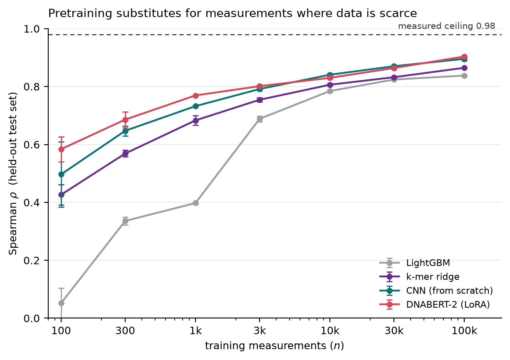
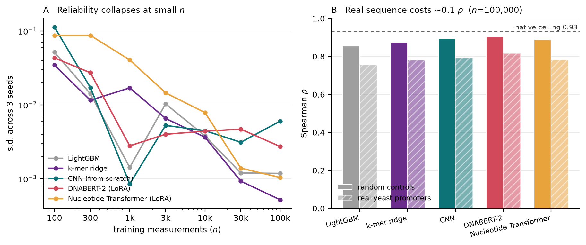
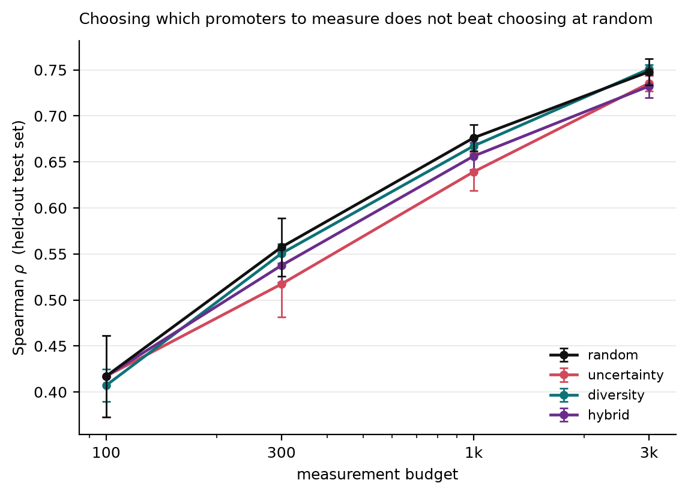
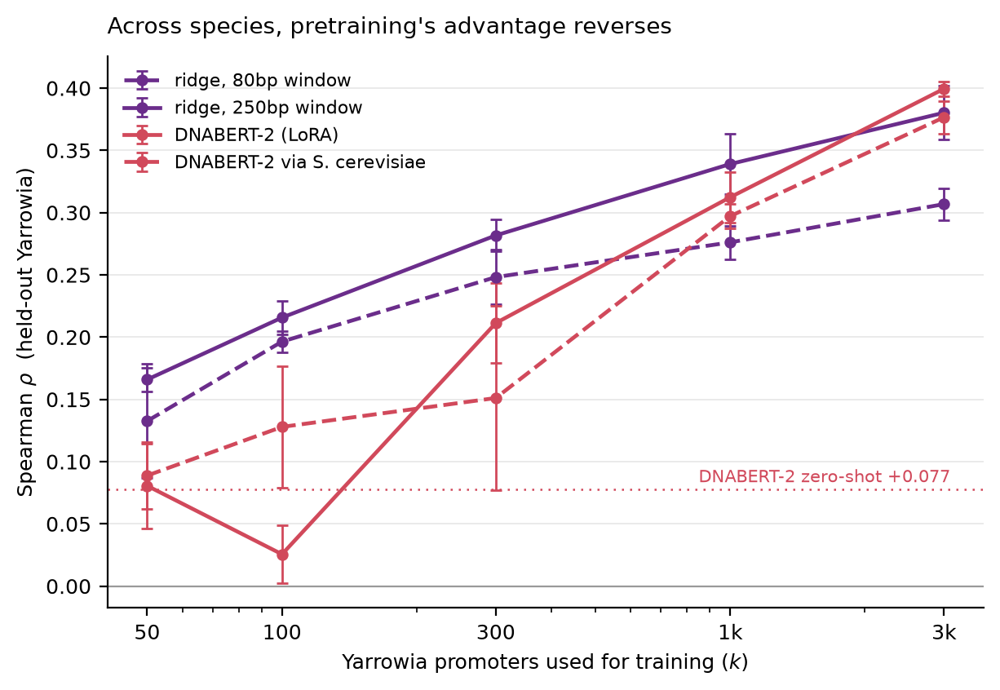

# yeast-promoter-lm

**How few experimental measurements are needed before sequence-based promoter strength
prediction becomes useful — and does pretraining on genomes substitute for the
measurements you cannot afford?**

Uses de Boer et al. 2020 yeast GPRA data ([GSE104878](https://www.ncbi.nlm.nih.gov/geo/query/acc.cgi?acc=GSE104878),
31.3M random 80 bp promoters measured in living *S. cerevisiae*) as a simulator of data
scarcity, with transfer tested on a curated *Yarrowia lipolytica* benchmark built here.

---

## Headline results

**1. Within the training domain, pretraining is worth roughly 2–4× fewer measurements.**
A LoRA-adapted DNABERT-2 reaches Spearman 0.70 from 300 measured promoters — the accuracy
a from-scratch CNN needs 700 for, and k-mer ridge 1,390 for.

**2. But the margin over trivial features is modest, and this is reported first because it
could easily have gone the other way.** Sixteen dinucleotide frequencies reach ρ=0.763 on
the same test set. GC content *alone* reaches 0.604. DNABERT-2, with 117M parameters,
reaches 0.902. Most of this task is composition; the sophisticated part contributes ~0.14.
A 156k-parameter CNN trained from scratch also beats DNABERT-2 at n=10,000 and 30,000, and
the *second* language model tested (Nucleotide Transformer, 500M) is four times larger than
DNABERT-2 and loses to it everywhere, falling below plain ridge at n=300. **Which pretrained
model you use matters more than how big it is.**

**3. Choosing which promoters to measure does not beat choosing at random.** Uncertainty
sampling was consistently *worse*: a carefully chosen 300 was worth about 219 random ones.

**4. Across a species boundary, the advantage reverses.** The same DNABERT-2 that wins
hardest in the scarce regime within *S. cerevisiae* is significantly *beaten* by k-mer ridge
at k=50–300 *Yarrowia* promoters, catching up only at thousands. Zero-shot transfer is
worth less than 100 labelled target-species promoters.

**5. No model can pick the best few, at any training size.** precision@100 never exceeds
0.21, and is 0.01 on deliberately designed sequences — the actual promoter-design use case.

### Is this a useful predictive model?

Best model (DNABERT-2, n=100,000), across every evaluation set:

| evaluation set | Spearman ρ | R² | precision@100 |
|---|---|---|---|
| random 80-mers, clean labels *(primary)* | **0.902** | 0.77 | 0.16 |
| random 80-mer controls *(spike-in)* | 0.902 | 0.66 | 0.21 |
| random 80-mers, noisy labels *(secondary)* | 0.776 | 0.58 | 0.12 |
| real evolved *S. cerevisiae* promoters | 0.813 | 0.61 | 0.06 |
| deliberately designed sequences | 0.764 | 0.45 | 0.01 |
| *Yarrowia lipolytica* promoters | −0.015 | −22.0 | — |

Measured noise ceiling for this assay is **0.98** (agreement between independent
replicates), so 0.902 is 92% of what the measurement itself permits.

Read as a hierarchy of claims, strongest first:

- **Ranking sequences from its training distribution: strong.** Near the noise ceiling.
- **Predicting absolute values: moderate.** RMSE ≈ 2.1 on an 0–17 scale.
- **Ranking within the extremes: weak.** Restricted to the true top decile, ρ falls to 0.223.
- **Identifying the best few: fails.** See precision@100 above.
- **Working on another species: no.**

---

## Results in detail

### D1 — Accuracy against training set size

Spearman ρ on the held-out 9,982-sequence high-quality test set, mean of 3 seeds, 840 runs.

| measurements | GC only | dinucleotide | k-mer ridge | LightGBM | CNN | DNABERT-2 | NT-500M |
|---|---|---|---|---|---|---|---|
| 100 | — | — | 0.422 | 0.066 | 0.521 | **0.563** | 0.471 |
| 300 | — | — | 0.563 | 0.327 | 0.639 | **0.702** | 0.540 |
| 1,000 | — | — | 0.679 | 0.406 | 0.728 | **0.771** | 0.729 |
| 3,000 | — | — | 0.756 | 0.692 | 0.794 | **0.801** | 0.788 |
| 10,000 | — | — | 0.806 | 0.784 | **0.838** | 0.831 | 0.828 |
| 30,000 | — | — | 0.832 | 0.824 | **0.868** | 0.868 | 0.859 |
| 100,000 | 0.604 | 0.763 | 0.865 | 0.839 | 0.897 | **0.902** | 0.888 |



**Reliability matters as much as accuracy.** At n=100 the CNN varies by 0.22 Spearman
across three seeds on identical data. Single-seed results at small n are not results.
Spread collapses by n=1,000.



### D2 — Does choosing what to measure help?

| budget | random | uncertainty | diversity | hybrid |
|---|---|---|---|---|
| 300 | **0.557** | 0.517 | 0.551 | 0.538 |
| 1,000 | **0.676** | 0.639 | 0.667 | 0.656 |
| 3,000 | 0.748 | 0.735 | **0.751** | 0.732 |

No strategy beats random. Uncertainty sampling introduces sampling bias — it selects
sequences with mean label 10.30 against a pool mean of 9.51, and a training set that does
not match the test distribution generalises worse. Diversity sampling has nothing to
exploit: MMseqs2 finds 99.84% singletons, so a random library has no under-sampled regions.



### D3 — What did the models actually learn?

ISM over 4,000 held-out sequences → TF-MoDISco → matched against the 245 motifs de Boer
used (YeTFaSCo matrices) plus a poly-A motif.

| | CNN | DNABERT-2 |
|---|---|---|
| patterns found | 6 | **11** |
| matching a known motif | 6 | 10 |
| poly-A recovered | ✅ 3 patterns | ✅ 3 patterns |
| RSC30 / RSC3 | ✅ | ✅ |
| **REB1** | ❌ | ✅ **r=0.95** |
| repressive patterns | 1 | **5** |

Pretraining did not only improve accuracy — it found more of the real regulatory grammar,
including a canonical activator the from-scratch model missed entirely. That is a
mechanism for D1's data-efficiency result rather than an efficiency claim alone.
Rap1 and Abf1, which de Boer highlight, were recovered by neither.

### D4 — Cross-species transfer

A *Yarrowia lipolytica* benchmark had to be built, because none existed in usable form:

| benchmark | n | source | learnable in-domain? |
|---|---|---|---|
| reporter-measured promoters | 81 | Zhang et al. preprint + CLIB122 genome | **no** (CV ρ ≈ 0, p > 0.1) |
| RNA-seq derived | **6,045** | Lubuta et al. 2019 TPM + CLIB122 genome | **yes** (CV ρ = 0.390) |

The 81-promoter reporter set is the largest assemblable from published reporter assays and
is *too small to learn from at all*, which makes transfer unevaluable rather than refuted.
The RNA-seq set is large enough, at the cost of a weaker label (mRNA abundance is not
promoter strength; the two correlate at ρ=0.428 on the 80 promoters present in both).

**Window length matters, and confirms the promoter-architecture literature.** On the
RNA-seq benchmark, 250bp upstream (ρ=0.390) beats both 80bp (0.325) and 1000bp (0.345).
Blazeck et al. put a minimal *Y. lipolytica* promoter at 130–260bp upstream of the ATG —
the empirical optimum falls inside that range, so the 80bp window imposed by de Boer's
training data is a genuine handicap for this species.

**Seven transfer methods, none beating from-scratch:**

| k (Yarrowia promoters) | ridge 80bp | ridge 250bp | DNABERT-2 | DNABERT-2 via *S. cer* |
|---|---|---|---|---|
| 50 | 0.133 | **0.166** | 0.081 | 0.089 |
| 100 | 0.196 | **0.216** | 0.026 | 0.128 |
| 300 | 0.248 | **0.282** | 0.211 | 0.151 |
| 1,000 | 0.276 | **0.339** | 0.312 | 0.297 |
| 3,000 | 0.307 | 0.380 | **0.399** | 0.377 |

Also tested and no better: zero-shot (ρ=−0.010), ridge shrunk toward the *S. cerevisiae*
coefficients (0.076 at k=3,000 — *worse* than shrinking toward zero), and the source
prediction used as a frozen feature (≈0).



**Why it fails, measured rather than speculated.** The two species' learned 6-mer
coefficient vectors are orthogonal (Pearson −0.0003), sharing only 2 of each model's
top-200 activating 6-mers — fewer than chance. The cause is composition: **GC content
predicts expression at ρ=+0.604 in de Boer's random library and −0.032 in Yarrowia's
native promoters.** The rule the source models learned most strongly is irrelevant in the
target species. This quantitatively confirms a published concern that genomic models may
lean on GC-content bias rather than functional regulatory grammar.

### D4a — The transfer ladder

One variable at a time, so a failure can be attributed:

| step | what changes | ρ (DNABERT-2, n=100k) |
|---|---|---|
| held-out random 80-mers | nothing | 0.902 |
| random spike-in controls | different experiment, same assay | 0.902 |
| real evolved promoters | random → evolved sequence | 0.813 |
| designed sequences | random → engineered | 0.764 |
| *Yarrowia* | **species** | **−0.015** |

Sequence type costs ~0.1 Spearman, consistently across all five model families
(+0.089 to +0.105). Species costs everything.

---

## Reproduce

```
git clone <repo> && cd yeast-promoter-lm
make all          # creates the venv, installs deps, regenerates every figure
```

`make all` works from a clean clone with no GPU and no data download: the 840 logged runs
are committed in `results/`, and every figure is rebuilt from them.

```
make data         # download GSE104878, parse, freeze splits  (~1 GB, ~15 min)
make baselines    # ridge, LightGBM, CNN                       (~1 h, CPU)
make lora         # DNABERT-2 and NT LoRA sweeps               (~9 h, CUDA GPU)
make active       # D2 selection curves                        (~2 min, CPU)
```

## What is in here

| path | |
|---|---|
| `PLAN.md` | the fixed specification. Scope is not changed against it silently |
| `STATE.md` | living status board and append-only decision log, including every deviation |
| `PREDICTIONS.md` | written blind, before any data was downloaded. Never edited |
| `src/evaluate.py` | **frozen** after Day 2, sha256 recorded. Every reported number comes from here |
| `data/splits/` | **frozen** index files. Never regenerated |
| `data/yarrowia/` | the two Yarrowia benchmarks built here |
| `results/runs.csv` | one row per run, 840 runs |

## Limitations

**Measurement noise cannot be filtered.** `PLAN.md` called for filtering training sequences
by read count, but de Boer published no per-sequence read counts. Training labels carry the
authors' estimated ~24% noise. Method comparisons are unaffected, but the absolute
measurement counts here are **pessimistic** — cleaner measurements would need fewer.

**Test-set overlap had to be removed.** The high-quality test library is a dilution of the
same pool as the training library, not an independent synthesis, so 6,651 of 9,982 test
sequences (66.6%) also appeared in training. Those rows were excluded from all training
subsamples. Uncaught, this would have inflated every curve silently.

**Most of the task is composition.** GC content alone gives ρ=0.604 and 16 dinucleotide
frequencies give 0.763, against 0.902 for a 117M-parameter model. Claims about what these
models "learn" should be read against that baseline.

**Limited tuning budget.** Hyperparameters were fixed a priori, not searched. LightGBM's
collapse at n=100 (ρ=0.066) is substantially an artefact of early stopping judged on a
20-sequence validation set, and part of NT's underperformance may be the same. The honest
claim is "with this tuning budget".

**One deviation from the specified training protocol.** `PLAN.md` specifies 50 warmup steps.
At n=100 that is ~17 epochs, and two of three seeds stopped mid-warmup having never trained
at the intended learning rate. Warmup became `min(50, 10% of planned steps)` with a guard
against stopping before it completes. This affects n ≤ 300 only; n ≥ 1,000 uses the
specified 50 steps unchanged. n=100 moved from 0.332 to 0.584.

**Nucleotide Transformer is the 500M checkpoint, not 2.5B**, because of disk constraints.
Its architecture also required different LoRA target modules and a different tokenisation,
so it is not a like-for-like comparison with DNABERT-2.

**The Yarrowia RNA-seq label is a proxy.** mRNA abundance is confounded by transcript
stability and reflects promoters in native chromatin, not a fixed reporter scaffold. It
correlates with reporter-measured strength at ρ=0.428 on the 80 promoters in both sets.

**We do not know what region the reporter study cloned.** Sequences for the 81-promoter
benchmark were taken as 1000bp of genomic upstream sequence. If Zhang et al. cloned a
different span, those sequences do not correspond to what was measured — which alone could
explain that benchmark's failure.

**Cross-species conclusions rest on one species pair.** *S. cerevisiae* → *Yarrowia* is a
large evolutionary distance. Transfer between closer relatives is untested here, so the
result should not be read as a general claim about all cross-species transfer.

**Single dataset, single context.** One library, one scaffold (pTpA), one carbon source
(glucose), one organism for training. Galactose, glycerol and a second scaffold exist in
the same GEO record and were not used.

**The negative active-learning result is specific to a random library.** With 99.84%
singletons there is no cluster structure for diversity sampling to exploit. Selection was
also one-shot rather than iterative, and diversity clustered k-mer features rather than
language-model embeddings.

**Sequence length weakly confounds expression** (ρ=0.09 test, 0.06 train). k-mer counts
are unnormalised, so models can see length indirectly.

**The cluster-based split is degenerate here.** Reported alongside the random split as
specified, but with 99.84% singletons the two coincide (agreeing to <0.005 at n ≥ 1,000).

## References

- de Boer et al. (2020). Deciphering eukaryotic gene-regulatory logic with 100 million
  random promoters. *Nat Biotechnol* 38(1):56–65. GEO: GSE104878.
- Zhou et al. (2024). DNABERT-2. *ICLR 2024*.
- Dalla-Torre et al. (2023). The Nucleotide Transformer.
- Hu et al. (2022). LoRA: Low-Rank Adaptation of Large Language Models. *ICLR 2022*.
- Steinegger & Söding (2017). MMseqs2. *Nat Biotechnol* 35(11):1026–1028.
- Blazeck et al. (2011). Tuning gene expression in *Yarrowia lipolytica* by a hybrid
  promoter approach. *Appl Environ Microbiol* 77(22):7905–7914.
- Lubuta et al. (2019). Investigating the influence of glycerol on the utilization of
  glucose in *Yarrowia lipolytica* using RNA-Seq-based transcriptomics. *G3* 9(12):4059–4071.
- de Boer Supplementary Table 2 motifs via YeTFaSCo (Spivak & Stormo 2012).
